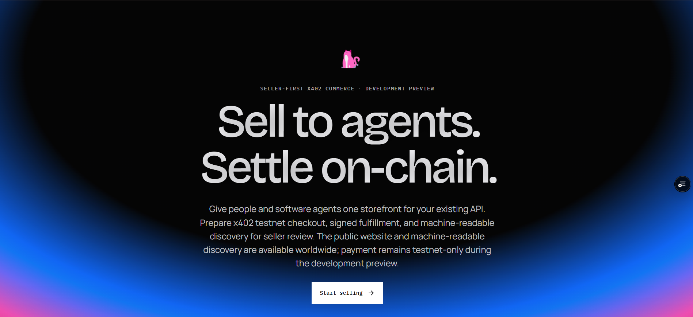
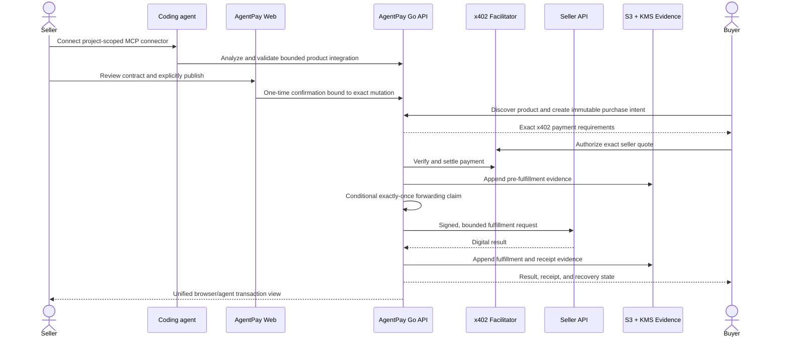
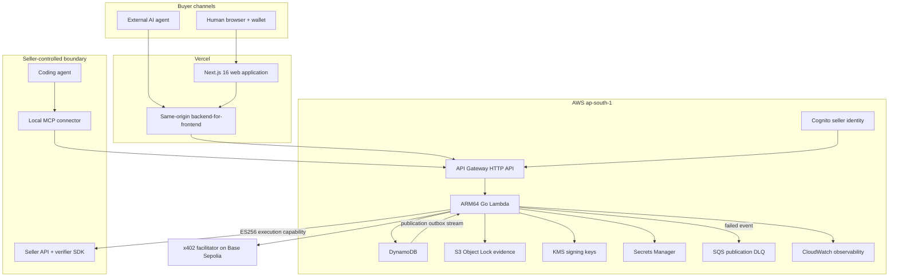

<div align="center">
  <a href="https://agentpay.prathamranka.in">
    
  </a>

  # AgentPay

  **Sell APIs to people and AI agents. Settle on-chain with x402.**

  AgentPay turns an existing API or digitally fulfilled service into a seller-controlled storefront with human checkout, machine-readable discovery, exact-price x402 payments, signed fulfillment, and auditable evidence.

  [](https://github.com/PrathamRanka/fourGeez/stargazers)
  [](https://agentpay.prathamranka.in)
  [](https://www.youtube.com/watch?v=yupTRoTKlgo)
  [](LICENSE)
</div>

---
## Product preview

<div align="center">
  <a href="https://agentpay.prathamranka.in">
    
  </a>
  <p><em>The deployed AgentPay landing page.</em></p>
</div>

## The problem

APIs are built to be called, but selling access still forces a developer to assemble authentication, pricing, checkout, payment verification, fulfillment, receipts, evidence, disputes, and separate buyer experiences. Conventional checkout is also difficult for software agents to discover and use safely.

AgentPay solves this by making one seller-owned API product purchasable through two channels without creating two commerce systems:

- a human buyer uses a hosted, seller-branded storefront;
- an external AI agent uses signed machine-readable discovery and x402-compatible HTTP payment;
- both channels create the same immutable purchase intent, obey the same quote and policy checks, use the same settlement boundary, and reach the same exactly-once fulfillment path.

The seller keeps control of the product, price, publication, payment destination, and fulfillment endpoint. AgentPay does not custody buyer funds and never requests wallet private keys.

## Why AgentPay is technically different

- **One authoritative contract:** browser and agent buyers consume the same versioned product, price, schema, and fulfillment contract.
- **Exact-price safety:** the seller's frozen quote is authoritative; underpayment and overpayment are rejected.
- **Bounded buyer consent:** `maximumAmount` is only a ceiling. The wallet authorizes the exact seller price.
- **Immutable intent:** request hash, route version, quote, asset, network, and destination are frozen before payment.
- **Exactly-once forwarding:** DynamoDB conditional writes allow only one caller to claim seller fulfillment.
- **No duplicate charging:** retries reuse the same transaction and proof; AgentPay never creates a replacement charge when payment outcome is uncertain.
- **Short-lived authority:** ES256 execution capabilities authorize one exact finalized transaction and seller request.
- **Machine discovery:** signed manifests, product documents, `llms.txt`, and public capability endpoints allow agents to inspect compatibility before creating commerce state.
- **Auditable evidence:** append-only evidence events are hashed, chained, stored under S3 Object Lock, and signed with KMS.
- **Seller-controlled automation:** coding agents can prepare an integration through bounded MCP tools, but commercial cloud mutations require an authenticated, one-time seller confirmation grant.

## End-to-end purchase flow



## System architecture



### Runtime boundaries

1. **Public web boundary:** Next.js renders the marketing site, documentation, public storefronts, product pages, and browser checkout.
2. **Seller identity boundary:** Cognito authenticates seller control-plane requests. Seller ownership comes from verified identity, not a caller-supplied seller ID.
3. **Commerce boundary:** the Go API freezes intents, evaluates buyer limits, issues x402 challenges, verifies settlement, and owns transaction state transitions.
4. **Seller execution boundary:** only finalized payment can mint the short-lived capability used to call a seller endpoint.
5. **Evidence boundary:** allowlisted metadata and hashes are retained; raw payment proofs, wallet material, authorization headers, cookies, and unrestricted seller responses are excluded.
6. **Coding-agent boundary:** the local connector stores the project bootstrap credential and exchanges it for short-lived seller-scoped MCP access. It cannot independently publish, settle, or mint payment authority.

## AWS usage

AgentPay uses AWS as the authoritative security, transaction, identity, persistence, and evidence platform—not just as a deployment target. Infrastructure is reproducible through Terraform and separated into foundation, identity, application, operator-access, observability, and cost-control concerns.

| AWS service | How AgentPay uses it | Why it matters |
| --- | --- | --- |
| **AWS Lambda** | Runs the Go modular monolith and MCP endpoint on ARM64 with bounded concurrency and timeouts. | Keeps deployment compact while preserving domain package boundaries. |
| **Amazon API Gateway HTTP API** | Exposes REST and MCP routes, throttling, JWT authorization, access logging, and Lambda integration. | Provides one controlled ingress for browser, agent, and seller automation traffic. |
| **Amazon DynamoDB** | Stores sellers, products, immutable intents, transactions, idempotency records, publication snapshots, entitlement projections, and replay claims. | Conditional writes enforce uniqueness, state transitions, and exactly-once fulfillment under concurrency. |
| **DynamoDB Streams** | Drives the durable publication-completion outbox processor. | Recovers publication work without treating an in-memory side effect as authoritative. |
| **Amazon S3** | Stores append-only evidence with versioning, encryption, public-access blocking, deletion protection, and 30-day governance Object Lock. | Makes transaction evidence durable and resistant to silent modification or deletion. |
| **AWS KMS** | Uses asymmetric P-256 keys for evidence signatures and versioned ES256 capability signing; also encrypts application secrets. | Private signing material stays inside AWS cryptographic boundaries. |
| **Amazon Cognito** | Provides email-verified seller registration, sign-in, recovery, revocation, and JWT identity. | Separates seller identity from buyer payment and seller project credentials. |
| **AWS Secrets Manager** | Stores credential and confirmation-grant peppers plus seller-scoped secret references under KMS encryption. | Secrets are not committed, serialized to browsers, logged, or stored as Terraform secret values. |
| **Amazon SQS** | Retains failed publication-outbox events after bounded retries and batch bisection. | Gives operators a durable recovery path for asynchronous failures. |
| **Amazon CloudWatch** | Collects structured logs and metrics and hosts the operations dashboard plus 13 deployed alarms. | Makes checkout, facilitator, evidence, forwarding, Lambda, and API failures observable. |
| **AWS IAM** | Defines least-privilege runtime, evidence-verifier, deployment, and environment-bound operator roles. | Privileged operations are scoped and auditable instead of using shared administrator credentials. |
| **AWS Budgets** | Applies a Terraform-managed monthly development budget. | Keeps the student hackathon deployment cost-aware and reproducible. |

### Deployed AWS shape

- Region: `ap-south-1` (Mumbai)
- Compute: ARM64 `provided.al2023` Lambda
- Persistence: on-demand DynamoDB with point-in-time recovery
- Evidence: versioned S3 bucket with KMS encryption and Object Lock
- Signing: asymmetric KMS P-256 keys with additive key versions
- Identity: Cognito user pool and no-secret browser/BFF client
- Operations: CloudWatch dashboard, 13 alarms, access logs, and SQS DLQ
- Infrastructure: Terraform remote state in encrypted, versioned S3 with native lock-file contention

## Data, consistency, and failure design

### Money and policy

- Money crosses system boundaries as validated atomic-unit strings; floating point is never used.
- A buyer maximum cannot change the seller's price.
- Amount, asset, network, destination, resource, and request must match exactly before fulfillment.
- Model output is untrusted input and cannot authorize payment, modify limits, or execute purchases.

### Idempotency and concurrency

- Every documented mutation has an idempotency boundary.
- Payment identifiers are unique under conditional writes.
- One DynamoDB transition claims a finalized transaction for forwarding; losing callers do not call the seller.
- A corrected-input retry is allowed only when non-delivery is provably side-effect-free and reuses the original payment.

### Failure behavior

- Facilitator failure before verification returns a retryable error and never calls the seller.
- Evidence failure before forwarding stops the transaction before seller execution.
- Unknown payment outcome enters reconciliation instead of creating a second charge.
- Ambiguous seller delivery enters review/dispute recovery instead of automatic duplicate fulfillment.
- Inactive seller entitlement blocks new publication, intents, payment, and capability minting while preserving required historical records.

## Security model

- Reject unknown JSON fields on control-plane APIs.
- Apply body, timeout, seller-response, and candidate-count limits.
- Protect seller forwarding from private, loopback, link-local, metadata, redirect, IPv6, and DNS-rebinding SSRF paths.
- Use constant-time comparison for tokens and HMACs.
- Never expose AWS, seller, wallet, payment-proof, or project credentials to browser JavaScript or model prompts.
- Bind browser purchase capabilities to the seller, route, request hash, maximum amount, and channel.
- Bind MCP confirmation grants to the seller, credential, tool, target, canonical arguments hash, expected version, expiry, and one-time use.
- Verify seller execution capabilities against the published JWKS and exact method, path, body hash, transaction, route, and seller audience.

See [`docs/SECURITY.md`](docs/SECURITY.md) for the complete threat model.

## Technology stack

| Layer | Technology |
| --- | --- |
| Web | Next.js 16, React 19, TypeScript 5.9, Tailwind CSS 4 |
| API | Go 1.26 modular monolith |
| Cloud | Lambda, API Gateway, DynamoDB, S3, KMS, Cognito, Secrets Manager, SQS, CloudWatch, IAM, Budgets |
| Infrastructure | Terraform with remote encrypted/versioned state |
| Payments | x402 v2-compatible exact payments, Base Sepolia, USDC testnet |
| Seller integration | MCP local connector and compact TypeScript merchant SDK |
| Testing | Go tests, Vitest, Playwright, axe-core, Lighthouse, contract tests |
| Deployment | Vercel frontend/BFF and AWS serverless backend |

## Run AgentPay locally

### Prerequisites

- Node.js 24 or newer
- npm 11 or newer
- Go 1.26 or newer
- Ports `3000`, `8080`, `8090`, and `8091` available

### Start the complete disposable environment

```powershell
npm install
npm run dev:local
```

| Local service | URL |
| --- | --- |
| Next.js web app | `http://localhost:3000` |
| Go API | `http://127.0.0.1:8080` |
| Demo seller | `http://127.0.0.1:8090` |
| Mock x402 facilitator | `http://127.0.0.1:8091` |

Sign in at `http://localhost:3000/sign-in` with the disposable local account:

```text
Email: pratham@agentpay.local
Password: AgentPayLocalDemo2026
```

The launch-ready seed includes published products, browser and agent test transactions, evidence, disputes, webhook history, integration state, and asset/network-separated analytics. Press `Ctrl+C` once to stop the supervised process tree; local state and credentials are ephemeral.

See the [local development runbook](docs/runbooks/LOCAL_DEVELOPMENT.md) for details.

## Verification

```powershell
npm run lint
npm run typecheck
npm test
npm run build
npm run test:e2e
```

The repository also contains focused contract, security-regression, Terraform-layout, package-distribution, seller-onboarding, deployed-auth smoke, buyer-channel parity, accessibility, responsive, and Lighthouse checks.

## Repository map

```text
apps/web/                       Next.js site, dashboard, storefront, and checkout
cmd/ and internal/              Go API, domain packages, adapters, and workers
packages/local-mcp-connector/   Seller-side coding-agent connector
packages/merchant-sdk/          Seller request and webhook verification SDK
infra/terraform/                Reproducible AWS infrastructure
verification/                   Independent receipt and evidence verification
e2e/                            Playwright journeys and quality tests
docs/                           Product, API, security, data, and runbook contracts
rl/                             Offline ranking experiments with no payment authority
```

## Current status and limitations

As of **September 20, 2026**, the public website, Cognito seller authentication, Go Lambda, HTTP API, DynamoDB, protected evidence storage, KMS capability signing, durable publication outbox, CloudWatch dashboard/alarms, and Vercel deployment are running in the development environment. Local browser and external-agent purchase parity is covered by deterministic end-to-end tests.

AgentPay remains a **development preview**. Payments are limited to local mock mode and x402 testnet on Base Sepolia USDC. Remaining release gates include preserved deployed testnet transaction evidence, the complete production-shaped journey, SNS notification delivery, teardown verification, and external security/legal review. Do not use the current deployment for real funds.

Authoritative progress is tracked in [`docs/IMPLEMENTATION.md`](docs/IMPLEMENTATION.md).

## Team fourGeez

| Builder | Focus | Links |
| --- | --- | --- |
| Pratham Ranka | Product direction, seller experience, commerce and platform systems | [GitHub](https://github.com/PrathamRanka) · [LinkedIn](https://www.linkedin.com/in/prathamranka06/) |
| Ayush Garg | Application foundations, integrations, and production delivery | [GitHub](https://github.com/gargayush1911) · [LinkedIn](https://www.linkedin.com/in/gargayush1911/) |

## Documentation

- [Documentation index](docs/README.md)
- [Product contract](docs/PRODUCT.md)
- [System architecture](docs/ARCHITECTURE.md)
- [OpenAPI contract](docs/api/openapi.yaml)
- [Security model](docs/SECURITY.md)
- [Data model](docs/DATA_MODEL.md)
- [Hackathon demo runbook](docs/runbooks/DEMO.md)
- [AWS deployment guide](docs/AWS_SETUP.md)

## Ownership and license

AgentPay is proprietary source and is not an open-source project. Copyright © 2026 Pratham Ranka and Ayush Garg in their respective AgentPay-authored materials; all rights are reserved. See [LICENSE](LICENSE), [NOTICE](NOTICE), and [repository governance](docs/REPOSITORY_GOVERNANCE.md).

